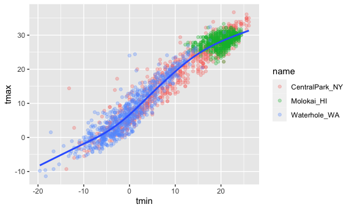
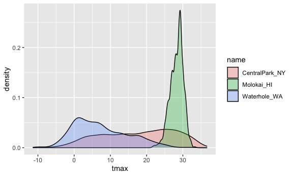
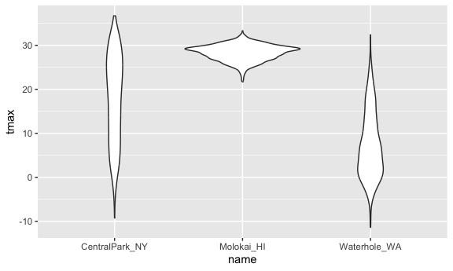
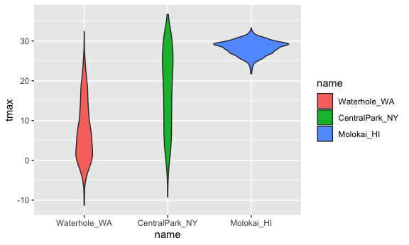

visualiztion_1
================
Aiying Huang
2023-09-28

``` r
library(tidyverse)
```

    ## ── Attaching core tidyverse packages ──────────────────────── tidyverse 2.0.0 ──
    ## ✔ dplyr     1.1.3     ✔ readr     2.1.4
    ## ✔ forcats   1.0.0     ✔ stringr   1.5.0
    ## ✔ ggplot2   3.4.3     ✔ tibble    3.2.1
    ## ✔ lubridate 1.9.3     ✔ tidyr     1.3.0
    ## ✔ purrr     1.0.2     
    ## ── Conflicts ────────────────────────────────────────── tidyverse_conflicts() ──
    ## ✖ dplyr::filter() masks stats::filter()
    ## ✖ dplyr::lag()    masks stats::lag()
    ## ℹ Use the conflicted package (<http://conflicted.r-lib.org/>) to force all conflicts to become errors

``` r
library(ggridges)
library(patchwork)
```

# 格式设置

``` r
knitr::opts_chunk$set(
  fig.width = 6,
  fig.asp = .6,
  out.width = "90%"
)
```

``` r
weather_df = 
  rnoaa::meteo_pull_monitors(
    c("USW00094728", "USW00022534", "USS0023B17S"),
    var = c("PRCP", "TMIN", "TMAX"), 
    date_min = "2021-01-01",
    date_max = "2022-12-31") |>
  mutate(
    name = recode(
      id, 
      USW00094728 = "CentralPark_NY", 
      USW00022534 = "Molokai_HI",
      USS0023B17S = "Waterhole_WA"),
    tmin = tmin / 10,
    tmax = tmax / 10) |>
  select(name, id, everything())
```

    ## using cached file: /Users/ivyhuang/Library/Caches/org.R-project.R/R/rnoaa/noaa_ghcnd/USW00094728.dly

    ## date created (size, mb): 2023-09-28 14:58:19.691413 (8.524)

    ## file min/max dates: 1869-01-01 / 2023-09-30

    ## using cached file: /Users/ivyhuang/Library/Caches/org.R-project.R/R/rnoaa/noaa_ghcnd/USW00022534.dly

    ## date created (size, mb): 2023-09-28 14:58:25.37625 (3.83)

    ## file min/max dates: 1949-10-01 / 2023-09-30

    ## using cached file: /Users/ivyhuang/Library/Caches/org.R-project.R/R/rnoaa/noaa_ghcnd/USS0023B17S.dly

    ## date created (size, mb): 2023-09-28 14:58:27.288433 (0.994)

    ## file min/max dates: 1999-09-01 / 2023-09-30

Let’s make a plot!

``` r
ggplot(weather_df,aes(x=tmin,y=tmax))+
  geom_point()
```

    ## Warning: Removed 17 rows containing missing values (`geom_point()`).


pipes and stuff

``` r
weather_df|>
  filter(name=="CentralPark_NY")|>
  ggplot(aes(x=tmin,y=tmax))+
  geom_point()
```


``` r
ggp_nyc_weather=
  weather_df|>
  filter(name=="CentralPark_NY")|>
  ggplot(aes(x=tmin,y=tmax))+
  geom_point()
```

## Fancy plot

``` r
ggplot(weather_df,aes(x=tmin,y=tmax,color=name))+
  geom_point()+
  geom_smooth()
```

    ## `geom_smooth()` using method = 'loess' and formula = 'y ~ x'

    ## Warning: Removed 17 rows containing non-finite values (`stat_smooth()`).

    ## Warning: Removed 17 rows containing missing values (`geom_point()`).


``` r
ggplot(weather_df,aes(x=tmin,y=tmax))+
  geom_point(aes(color=name))+
  geom_smooth()
```

    ## `geom_smooth()` using method = 'gam' and formula = 'y ~ s(x, bs = "cs")'

    ## Warning: Removed 17 rows containing non-finite values (`stat_smooth()`).

    ## Warning: Removed 17 rows containing missing values (`geom_point()`).


``` r
ggplot(weather_df,aes(x=tmin,y=tmax))+
  geom_point(aes(color=name),alpha=0.3)+
  geom_smooth(se=FALSE)#standar error
```

    ## `geom_smooth()` using method = 'gam' and formula = 'y ~ s(x, bs = "cs")'

    ## Warning: Removed 17 rows containing non-finite values (`stat_smooth()`).

    ## Warning: Removed 17 rows containing missing values (`geom_point()`).



Plot with facets

``` r
ggplot(weather_df,aes(x=tmin,y=tmax,color=name))+
  geom_point(alpha=.3)+
  geom_smooth()+
  facet_grid(. ~name)
```

    ## `geom_smooth()` using method = 'loess' and formula = 'y ~ x'

    ## Warning: Removed 17 rows containing non-finite values (`stat_smooth()`).

    ## Warning: Removed 17 rows containing missing values (`geom_point()`).


``` r
# alpha order
```

Let’s try a different plot

``` r
ggplot(weather_df,aes(x=date,y=tmax,color=name))+
  geom_point(aes(size=prcp),alpha=.3)+
  geom_smooth()+
  facet_grid(. ~name)
```

    ## `geom_smooth()` using method = 'loess' and formula = 'y ~ x'

    ## Warning: Removed 17 rows containing non-finite values (`stat_smooth()`).

    ## Warning: Removed 19 rows containing missing values (`geom_point()`).


try assigning a specific color

``` r
weather_df|>
  filter(name=="CentralPark_NY")|>
  ggplot(aes(x=date,y=tmax))+
  geom_point(color="blue")
```


``` r
weather_df|>
  filter(name!="CentralPark_NY")|>
  ggplot(aes(x=date,y=tmax,color=name))+
  geom_point()
```

    ## Warning: Removed 17 rows containing missing values (`geom_point()`).


``` r
weather_df|>
  filter(name!="CentralPark_NY")|>
  ggplot(aes(x=date,y=tmax,color=name))+
  geom_point(alpha=.3,size=.5)
```

    ## Warning: Removed 17 rows containing missing values (`geom_point()`).


hex plot :-)

``` r
weather_df|>
  ggplot(aes(x=tmin,y=tmax))+
  geom_hex()
```

    ## Warning: Removed 17 rows containing non-finite values (`stat_binhex()`).


\## univariate plotting

histogram

``` r
ggplot(weather_df,aes(x=tmax))+
  geom_histogram()
```

    ## `stat_bin()` using `bins = 30`. Pick better value with `binwidth`.

    ## Warning: Removed 17 rows containing non-finite values (`stat_bin()`).


``` r
ggplot(weather_df,aes(x=tmax,color=name,fill=name))+
  geom_histogram()
```

    ## `stat_bin()` using `bins = 30`. Pick better value with `binwidth`.

    ## Warning: Removed 17 rows containing non-finite values (`stat_bin()`).


``` r
ggplot(weather_df,aes(x=tmax,color=name,fill=name))+
  geom_histogram(position="dodge")
```

    ## `stat_bin()` using `bins = 30`. Pick better value with `binwidth`.

    ## Warning: Removed 17 rows containing non-finite values (`stat_bin()`).


let’s use a density plot

``` r
ggplot(weather_df,aes(x=tmax,fill=name))+
  geom_density(alpha=.3,adjust=.75)
```

    ## Warning: Removed 17 rows containing non-finite values (`stat_density()`).



``` r
ggplot(weather_df,aes(x=tmax,fill=name))+
  geom_density(alpha=.3,adjust=2)
```

    ## Warning: Removed 17 rows containing non-finite values (`stat_density()`).


using boxplots!!

``` r
ggplot(weather_df,aes(y=tmax,x=name))+
  geom_boxplot()
```

    ## Warning: Removed 17 rows containing non-finite values (`stat_boxplot()`).


violin plots?

``` r
ggplot(weather_df,aes(y=tmax,x=name))+
  geom_violin()
```

    ## Warning: Removed 17 rows containing non-finite values (`stat_ydensity()`).



ridge plot

``` r
ggplot(weather_df,aes(x=tmax,y=name))+
  geom_density_ridges()
```

    ## Picking joint bandwidth of 1.54

    ## Warning: Removed 17 rows containing non-finite values
    ## (`stat_density_ridges()`).


``` r
weather_df|>
  filter(name=="Molokai_HI")|>
  ggplot(aes(x=date,y=tmax))+
  geom_line(alpha=.5)+
  geom_point(alpha=.5)
```

    ## Warning: Removed 1 rows containing missing values (`geom_point()`).


## saving and embedding plots

``` r
ggp_weather=
weather_df|>
  ggplot(aes(x=tmin,y=tmax))+
  geom_point()

ggsave("Results/ggp_weather.pdf",ggp_weather)
```

    ## Saving 6 x 3.6 in image

    ## Warning: Removed 17 rows containing missing values (`geom_point()`).

``` r
ggp_weather
```

    ## Warning: Removed 17 rows containing missing values (`geom_point()`).


``` r
ggp_weather
```

    ## Warning: Removed 17 rows containing missing values (`geom_point()`).


``` r
ggp_weather
```

    ## Warning: Removed 17 rows containing missing values (`geom_point()`).


## same plot from last time

``` r
weather_df|>
  ggplot(aes(x=tmin,y=tmax,color=name))+
  geom_point(alpha=.5)+
  labs(
    title="Temperature plot",
    x="Mim daily temp (Degreesc)",
    y="Max daily temp",
    color="Location",
    caption="Max vs min daily temp in three locations;data from moaa"
  )
```

    ## Warning: Removed 17 rows containing missing values (`geom_point()`).


``` r
weather_df|>
  ggplot(aes(x=tmin,y=tmax,color=name))+
  geom_point(alpha=.5)+
  labs(
    title="Temperature plot",
    x="Mim daily temp (Degreesc)",
    y="Max daily temp",
    color="Location",
    caption="Max vs min daily temp in three locations;data from moaa"
  )+
  scale_x_continuous(
    breaks=c(-15,0,15),
    labels=c("-15 C","0","15")
  )+
  scale_y_continuous(
    position="right",
    trans="sqrt"
  )
```

    ## Warning in self$trans$transform(x): NaNs produced

    ## Warning: Transformation introduced infinite values in continuous y-axis

    ## Warning: Removed 142 rows containing missing values (`geom_point()`).


``` r
weather_df|>
  ggplot(aes(x=tmin,y=tmax,color=name))+
  geom_point(alpha=.5)+
  labs(
    title="Temperature plot",
    x="Mim daily temp (Degreesc)",
    y="Max daily temp",
    color="Location",
    caption="Max vs min daily temp in three locations;data from moaa"
  )+
  scale_x_continuous(
    breaks=c(-15,0,15),
    labels=c("-15 C","0","15")
  )+
  scale_y_continuous(
    position="right",
    limits=c(20,30)
  )
```

    ## Warning: Removed 1227 rows containing missing values (`geom_point()`).


what about colors…

``` r
weather_df|>
  ggplot(aes(x=tmin,y=tmax,color=name))+
  geom_point(alpha=.5)+
  labs(
    title="Temperature plot",
    x="Mim daily temp (Degreesc)",
    y="Max daily temp",
    color="Location",
    caption="Max vs min daily temp in three locations;data from moaa"
  ) +
  viridis::scale_color_viridis(discrete=TRUE)
```

    ## Warning: Removed 17 rows containing missing values (`geom_point()`).


## Themes

``` r
weather_df|>
  ggplot(aes(x=tmin,y=tmax,color=name))+
  geom_point(alpha=.5)+
  labs(
    title="Temperature plot",
    x="Mim daily temp (Degreesc)",
    y="Max daily temp",
    color="Location",
    caption="Max vs min daily temp in three locations;data from moaa"
  ) +
  viridis::scale_color_viridis(discrete=TRUE)+
  theme_bw()+#the order here makes a difference, cannot be changed
  theme(legend.position="bottom")
```

    ## Warning: Removed 17 rows containing missing values (`geom_point()`).


``` r
weather_df|>
  ggplot(aes(x=tmin,y=tmax,color=name))+
  geom_point(alpha=.5)+
  labs(
    title="Temperature plot",
    x="Mim daily temp (Degreesc)",
    y="Max daily temp",
    color="Location",
    caption="Max vs min daily temp in three locations;data from moaa"
  ) +
  viridis::scale_color_viridis(discrete=TRUE)+
  theme_minimal()+#the order here makes a difference, cannot be changed
  theme(legend.position="bottom")
```

    ## Warning: Removed 17 rows containing missing values (`geom_point()`).


\##选择使用”viridis”颜色主题的原因是因为它在数据可视化中具有一些优点，特别是在表示渐变数据时。以下是一些选择”viridis”颜色主题的原因：

良好的可读性：“viridis”颜色主题经过精心设计，确保颜色在不同亮度和饱和度下都能够清晰可辨。这使得图表更容易阅读，尤其是在印刷品和屏幕上。

高对比度：“viridis”颜色主题具有高对比度，可以凸显数据中的细微变化。这对于强调趋势和差异非常有帮助。

鉴别度高：“viridis”颜色主题的不同颜色之间的鉴别度很高，这意味着您可以在不同的数据系列之间轻松区分。

适用于色盲：“viridis”颜色主题考虑了色盲人士，确保即使在色觉有问题的人也能正确解释图表。

兼容性强：“viridis”颜色主题可以应用于各种数据类型和图表类型，包括散点图、线图、热图等。

总之，“viridis”颜色主题被认为是一种有效的选择，因为它提供了良好的可视效果，有助于传达数据的重要信息，同时考虑了观众的可读性和色盲问题。

## data argument…

``` r
weather_df|>
  ggplot(aes(x=date,y=tmax))+
  geom_point(aes(color=name))+
  geom_smooth()
```

    ## `geom_smooth()` using method = 'gam' and formula = 'y ~ s(x, bs = "cs")'

    ## Warning: Removed 17 rows containing non-finite values (`stat_smooth()`).

    ## Warning: Removed 17 rows containing missing values (`geom_point()`).


``` r
weather_df|>
  ggplot(aes(x=date,y=tmax,color=name))+
  geom_point()+
  geom_smooth()
```

    ## `geom_smooth()` using method = 'loess' and formula = 'y ~ x'

    ## Warning: Removed 17 rows containing non-finite values (`stat_smooth()`).

    ## Warning: Removed 17 rows containing missing values (`geom_point()`).


``` r
nyc_weather_df=
  weather_df|>
  filter(name=="CentralPark_NY")
hawaii_weather_df=
  weather_df|>
  filter(name=="Molokai_HI")

ggplot(nyc_weather_df,aes(x=date,y=tmax,color=name))+
  geom_point()+
  geom_line(data=hawaii_weather_df)
```


``` r
##process the data before plot is always a good choice
```

## `patchwork`

``` r
weather_df|>
  ggplot(aes(x=date,y=tmax,color=name))+
  geom_point()+
  facet_grid(.~name)
```

    ## Warning: Removed 17 rows containing missing values (`geom_point()`).


``` r
##facet is used to duplicate the same type of plots 
```

``` r
ggp_temp_scatter=
  weather_df|>
  ggplot(aes(x=tmin,y=tmax,color=name))+
  geom_point(alpha=.5)+
  theme(legend.position="none")

ggp_prcp_density=
  weather_df|>
  filter(prcp>25)|>
  ggplot(aes(x=prcp,fill=name))+
  geom_density(alpha=.5)+
  theme(legend.position="none")

ggp_tmax_date=
  weather_df|>
  ggplot(aes(x=date,y=tmax,color=name))+
  geom_point()+
  geom_smooth(se=FALSE)+
  theme(legend.position="bottom")


(ggp_temp_scatter+ggp_prcp_density)/ggp_tmax_date
```

    ## Warning: Removed 17 rows containing missing values (`geom_point()`).

    ## `geom_smooth()` using method = 'loess' and formula = 'y ~ x'

    ## Warning: Removed 17 rows containing non-finite values (`stat_smooth()`).
    ## Removed 17 rows containing missing values (`geom_point()`).


## data manipulation

``` r
weather_df|>
  ggplot(aes(x=name,y=tmax))+
  geom_boxplot()
```

    ## Warning: Removed 17 rows containing non-finite values (`stat_boxplot()`).


``` r
weather_df|>
  mutate(
    name=fct_relevel(name,c("Molokai_HI","CentralPark_NY","Waterhole_WA"))
  )|>
  ggplot(aes(x=name,y=tmax))+
  geom_boxplot()
```

    ## Warning: Removed 17 rows containing non-finite values (`stat_boxplot()`).


``` r
## ggplot will convert the chr to fact variable by alpha ording

weather_df|>
  mutate(
    name=fct_reorder(name,tmax)
  )|>
  ggplot(aes(x=name,y=tmax,fill=name))+
  geom_violin()
```

    ## Warning: There was 1 warning in `mutate()`.
    ## ℹ In argument: `name = fct_reorder(name, tmax)`.
    ## Caused by warning:
    ## ! `fct_reorder()` removing 17 missing values.
    ## ℹ Use `.na_rm = TRUE` to silence this message.
    ## ℹ Use `.na_rm = FALSE` to preserve NAs.

    ## Warning: Removed 17 rows containing non-finite values (`stat_ydensity()`).



## complicate FAS plot

``` r
litters_df=
  read_csv("./Data/FAS_litters.csv")|>
  janitor::clean_names()|>
  separate(group,into=c("dose","day_of_tx"),sep=3)
```

    ## Rows: 49 Columns: 8
    ## ── Column specification ────────────────────────────────────────────────────────
    ## Delimiter: ","
    ## chr (2): Group, Litter Number
    ## dbl (6): GD0 weight, GD18 weight, GD of Birth, Pups born alive, Pups dead @ ...
    ## 
    ## ℹ Use `spec()` to retrieve the full column specification for this data.
    ## ℹ Specify the column types or set `show_col_types = FALSE` to quiet this message.

``` r
pups_df=
  read_csv("./Data/FAS_pups.csv")|>
  janitor::clean_names()
```

    ## Rows: 313 Columns: 6
    ## ── Column specification ────────────────────────────────────────────────────────
    ## Delimiter: ","
    ## chr (1): Litter Number
    ## dbl (5): Sex, PD ears, PD eyes, PD pivot, PD walk
    ## 
    ## ℹ Use `spec()` to retrieve the full column specification for this data.
    ## ℹ Specify the column types or set `show_col_types = FALSE` to quiet this message.

``` r
fas_df=
  left_join(pups_df,litters_df,by="litter_number")
fas_df|>
  select(dose,day_of_tx,starts_with("pd"))|>
  pivot_longer(
    pd_ears:pd_walk,
    names_to="outcome",
    values_to="pn_day"
  )|>
  drop_na()|>
  mutate(outcome=fct_reorder(outcome,pn_day))|>
  ggplot(aes(x=dose,y=pn_day))+
  geom_violin()+
  facet_grid(day_of_tx~outcome)
```


